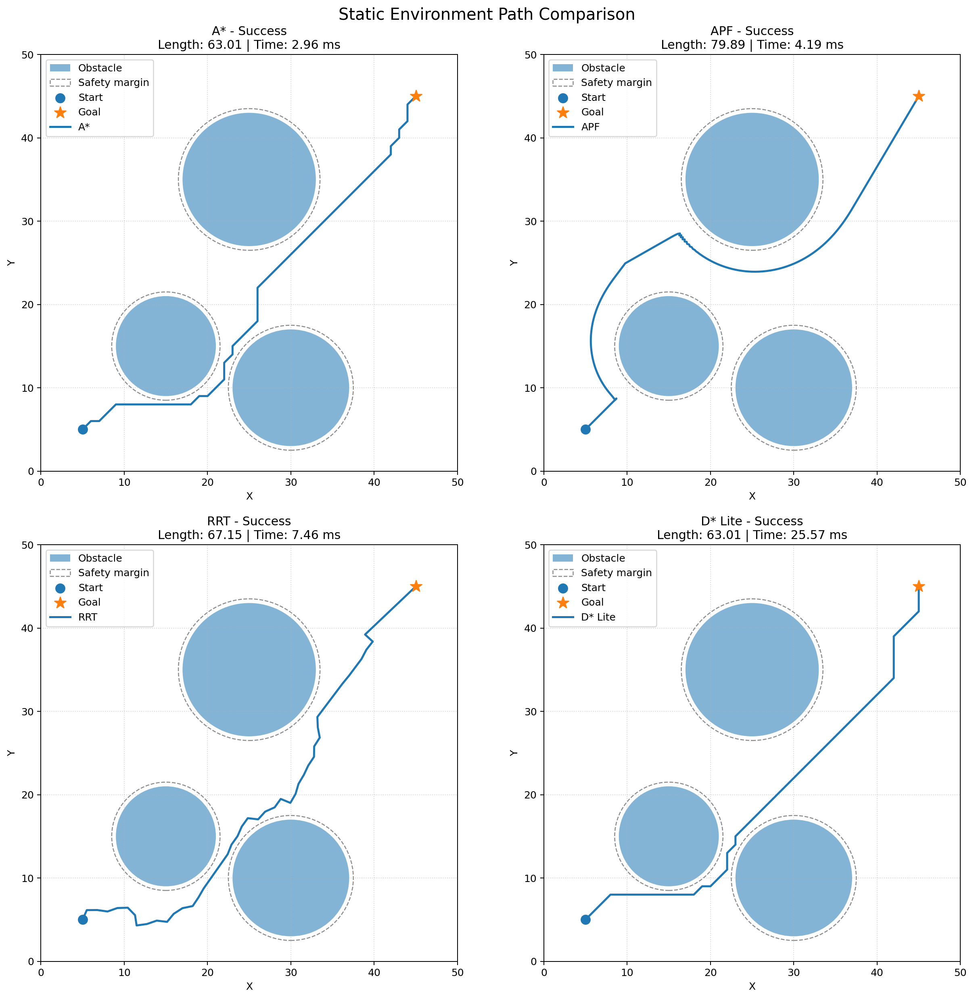
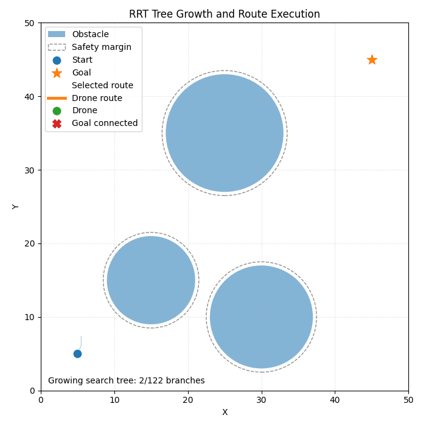

# Classical Path Planning Algorithms

A*, Artificial Potential Field(APF), Rapidly-exploring Random Tree(RRT), D* Lite를 동일한 2차원 환경에서 구현하고 비교한 프로젝트이다.  
정적 환경에서는 네 알고리즘의 경로 품질과 계산 결과를 비교하며, 동적 환경에서는 D* Lite가 이동 중 발견한 장애물에 대응하여 기존 탐색 정보를 재사용하고 경로를 갱신하는 과정을 확인한다.

> 본 프로젝트는 각 알고리즘의 핵심 아이디어를 학습하고 비교하기 위한 구현이다. 참고 논문의 실험을 그대로 재현한 것이 아니라, 공통 시나리오와 평가 방식에 맞게 단순화하고 일부 보조 로직을 추가하였다.

---

## 1. 프로젝트 목표

- 서로 다른 계열의 경로 계획 알고리즘을 동일한 환경에서 비교한다.
- 격자 기반, 포텐셜 필드 기반, 샘플링 기반, 증분 탐색 기반 방법의 차이를 확인한다.
- 경로 길이, 계산 시간, waypoint 수, 장애물 최소 여유 거리 등을 공통 형식으로 기록한다.
- 정적 결과뿐 아니라 GIF 애니메이션을 통해 탐색 및 재계획 과정을 시각화한다.

---

## 2. 구현 알고리즘

| 알고리즘 | 분류 | 공간 표현 | 주요 특징 |
|---|---|---|---|
| A* | 휴리스틱 그래프 탐색 | 격자 | 누적 비용과 목표까지의 추정 비용을 함께 사용한다. |
| APF | 반응형 경로 계획 | 연속 공간 | 목표의 인력과 장애물의 척력을 합성한다. |
| RRT | 샘플링 기반 탐색 | 연속 공간 | 무작위 샘플을 향해 트리를 빠르게 확장한다. |
| D* Lite | 증분 휴리스틱 탐색 | 격자 | 환경 변화 시 기존 탐색 정보를 재사용한다. |

---

## 3. 정적 환경 비교

모든 알고리즘에 동일한 지도, 시작점, 목표점, 장애물, 안전 여유 거리를 적용하였다.

<p align="center">
  
</p>

### 한 차례 실행 결과

| 알고리즘 | 성공 | 경로 길이 | 계산 시간 | 경로 특성 |
|---|---:|---:|---:|---|
| A* | Yes | 63.01 | 2.96 ms | 격자 위에서 비교적 짧고 각진 경로를 생성하였다. |
| APF | Yes | 79.89 | 4.19 ms | 연속적이고 부드럽지만 우회가 큰 경로를 생성하였다. |
| RRT | Yes | 67.15 | 7.46 ms | 무작위 트리에서 발견한 실행 가능한 경로를 생성하였다. |
| D* Lite | Yes | 63.01 | 25.57 ms | 정적 환경에서는 A*와 유사한 격자 경로를 생성하였다. |

계산 시간은 실행 환경과 시스템 상태에 따라 달라지므로 절대적인 성능 순위로 해석하지 않는다. 또한 현재 비교는 하나의 시나리오와 고정된 RRT 난수 시드에서 수행한 결과이다.

---

## 4. 알고리즘별 핵심 원리와 구현

### 4.1 A*

A*는 시작점부터 현재 노드까지의 실제 누적 비용과 현재 노드부터 목표점까지의 추정 비용을 합하여 탐색 우선순위를 결정한다.

$$
f(n) = g(n) + h(n)
$$

- $g(n)$: 시작점에서 노드 $n$까지의 실제 누적 비용
- $h(n)$: 노드 $n$에서 목표점까지의 추정 비용
- $f(n)$: 우선순위 큐에서 사용하는 평가값

본 구현에서는 유클리드 거리를 휴리스틱으로 사용하였다.

$$
h(n) = \sqrt{(x_g-x_n)^2+(y_g-y_n)^2}
$$

#### 구현 방식

- Boolean occupancy grid에서 탐색하도록 구현하였다.
- 상하좌우 이동 비용은 $1$, 대각선 이동 비용은 $\sqrt{2}$로 설정하였다.
- 8방향 이동을 사용하되 막힌 두 격자 사이를 대각선으로 통과하는 corner cutting을 금지하였다.
- `heapq` 기반 우선순위 큐에 $f(n)$과 $g(n)$을 저장하였다.
- 목표 도달 후 `came_from` 부모 관계를 역추적하여 경로를 복원하였다.

---

### 4.2 Artificial Potential Field

APF는 목표점이 로봇을 끌어당기는 인력과 장애물이 로봇을 밀어내는 척력을 합성하여 다음 이동 방향을 결정한다.

$$
\mathbf{F}(q)=\mathbf{F}_{att}(q)+\mathbf{F}_{rep}(q)
$$

본 구현의 인력은 목표 방향의 단위 벡터에 인력 계수를 곱하는 형태이다.

$$
\mathbf{F}_{att}(q)
= k_{att}\frac{q_{target}-q}{\lVert q_{target}-q\rVert}
$$

장애물의 척력은 설정된 영향 거리 안에서만 발생하며, 장애물 경계에 가까워질수록 크게 증가하도록 구성하였다.

#### 구현 방식

- 연속 좌표 공간에서 작은 `step_size`만큼 반복 이동하도록 구현하였다.
- 원형 장애물의 반지름에 safety margin을 더한 영역을 충돌 영역으로 처리하였다.
- 인력과 모든 장애물의 척력을 합산하여 이동 희망 방향을 계산하였다.
- 희망 방향이 충돌하면 각도를 순차적으로 보정하여 충돌하지 않는 이동을 탐색하였다.
- APF의 대표적 한계인 로컬 미니마를 완화하기 위해, 일정 시간 목표 방향의 진전이 없을 경우 장애물 주변에 임시 접선형 waypoint를 생성하였다.

따라서 본 구현은 기본 APF에 결정론적 로컬 미니마 복구 로직을 추가한 형태이다.

---

### 4.3 Rapidly-exploring Random Tree

RRT는 탐색 공간에서 무작위 상태를 샘플링하고, 기존 트리에서 가장 가까운 노드로부터 샘플 방향으로 새로운 가지를 확장한다.

$$
q_{rand} \sim \mathcal{U}(\mathcal{X})
$$

$$
q_{\mathrm{near}}
=
\underset{q \in T}{\mathrm{arg\,min}}
\; d(q, q_{\mathrm{rand}})
$$

$$
q_{\mathrm{new}}
=
\mathrm{Steer}(q_{\mathrm{near}}, q_{\mathrm{rand}}, \Delta q)
$$

#### 구현 방식

- 지도 범위 안에서 무작위 점을 생성하였다.
- 일정 확률로 목표점을 직접 샘플링하는 goal bias를 적용하였다.
- 현재 트리에서 샘플과 가장 가까운 노드를 찾은 뒤 `step_size`만큼 확장하였다.
- 새 점의 충돌뿐 아니라 부모 노드와 새 점을 잇는 선분 전체의 충돌도 검사하였다.
- 새 노드마다 부모 인덱스를 저장하고, 목표 연결 후 부모 관계를 역추적하여 경로를 복원하였다.
- 재현 가능한 비교를 위해 난수 시드를 고정하였다.
- 생성된 부모-자식 간선을 별도로 기록하여 트리 성장, 목표 연결, 드론의 경로 추종 과정을 GIF로 표현하였다.

<p align="center">
  
</p>

기본 RRT는 실행 가능한 경로를 빠르게 탐색하는 데 목적이 있으며, 본 구현에는 RRT*의 rewiring이나 점근적 최적화 과정이 포함되어 있지 않다.

---

### 4.4 D* Lite

D* Lite는 환경 변화가 발생할 때 전체 경로를 처음부터 다시 탐색하지 않고, 이전 탐색에서 계산한 정보를 재사용하는 증분 휴리스틱 탐색 알고리즘이다.

각 정점은 두 비용값 $g(s)$와 $rhs(s)$를 가진다.

$$
rhs(s)=\min_{s'\in Succ(s)}\left(c(s,s')+g(s')\right)
$$

- $g(s)$: 현재 알고리즘이 유지하는 비용 추정값
- $rhs(s)$: 후속 정점 비용을 이용해 한 단계 앞에서 계산한 값
- $g(s)=rhs(s)$: 해당 정점의 비용 정보가 일관된 상태
- $g(s)\neq rhs(s)$: 다시 처리해야 하는 비일관 상태

우선순위 큐의 키는 다음 두 값으로 구성된다.

$$
key(s)=
\begin{bmatrix}
\min(g(s),rhs(s))+h(s_{start},s)+k_m\\
\min(g(s),rhs(s))
\end{bmatrix}
$$

#### 구현 방식

- A*와 같은 8방향 occupancy grid를 사용하였다.
- 목표점의 $rhs$를 0으로 설정하고 목표에서 시작점 방향으로 비용을 전파하였다.
- `g`, `rhs`, 두 요소 우선순위 키, $k_m$을 유지하였다.
- 에이전트가 이동하면 시작 위치와 $k_m$을 갱신하였다.
- 숨겨진 장애물이 센서 범위에 들어오면 새 occupancy grid와 기존 grid를 비교하였다.
- 상태가 변한 격자와 인접 정점만 `update_vertex` 대상으로 지정하였다.
- 기존 탐색 상태를 유지한 채 `compute_shortest_path`를 다시 수행하여 경로를 복구하였다.

---

## 5. 동적 재계획

동적 실험에서는 에이전트가 처음부터 알지 못하는 장애물을 설정하였다. 에이전트는 초기 경로를 따라 이동하고, 숨겨진 장애물이 센서 범위 안에 들어오면 현재 위치를 새 시작점으로 설정한 뒤 D* Lite 재계획을 수행한다.

<p align="center">
  
</p>

애니메이션은 다음 과정을 나타낸다.

1. 알려진 장애물만 반영한 초기 경로를 생성한다.
2. 에이전트와 함께 센서 범위가 이동한다.
3. 숨겨진 장애물을 감지한다.
4. 변경된 격자와 주변 정점을 갱신한다.
5. 현재 위치에서 목표까지 새로운 경로를 생성한다.
6. 에이전트가 재계획된 경로를 따라 이동한다.

---

## 6. 공통 실험 환경

| 항목 | 설정 |
|---|---|
| 지도 크기 | $50 \times 50$ |
| 시작점 | $(5, 5)$ |
| 목표점 | $(45, 45)$ |
| 장애물 표현 | 원형 장애물 |
| Safety margin | 0.5 |
| Grid resolution | 1.0 |
| RRT random seed | 42 |
| 이동 차원 | 2차원 평면 |

정적 실험에서는 모든 알고리즘이 같은 `Scenario` 객체를 입력받는다. A*와 D* Lite는 연속 지도를 occupancy grid로 변환하며, APF와 RRT는 연속 좌표와 선분 충돌 검사를 사용한다.

### 공통 평가 지표

- `success`: 목표 도달 여부
- `planning_time_ms`: 경로 계산 시간
- `path_length`: 연속 waypoint 사이의 유클리드 거리 합
- `waypoint_count`: 반환된 경로점의 수
- `minimum_clearance`: waypoint와 지도 경계 또는 장애물 안전영역 사이의 최소 거리

현재 `minimum_clearance`는 경로 선분 전체가 아니라 저장된 waypoint를 기준으로 계산한다.

---

## 7. 프로젝트 구조

```text
01_Classical/
├─ README.md
├─ requirements.txt
├─ run_static_comparison.py
├─ run_dynamic_replanning.py
├─ config/
│  └─ scenarios.py
├─ planners/
│  ├─ astar.py
│  ├─ apf.py
│  ├─ rrt.py
│  └─ dstar_lite.py
├─ utils/
│  ├─ collision.py
│  ├─ metrics.py
│  └─ visualization.py
└─ results/
   ├─ static/
   │  ├─ path_comparison.png
   │  ├─ astar_result.png
   │  ├─ apf_result.png
   │  ├─ rrt_result.png
   │  ├─ dstar_lite_result.png
   │  ├─ astar_animation.gif
   │  ├─ apf_animation.gif
   │  ├─ rrt_animation.gif
   │  ├─ dstar_lite_animation.gif
   │  └─ metrics.json
   └─ dynamic/
      ├─ dstar_lite_replanning.png
      ├─ dstar_lite_replanning.gif
      └─ metrics.json
```

---

## 8. 실행 방법

### 8.1 환경 설치

```bash
python -m venv .venv
```

Windows PowerShell:

```powershell
.venv\Scripts\Activate.ps1
```

패키지를 설치한다.

```bash
pip install -r requirements.txt
```

### 8.2 정적 비교 실행

```bash
python run_static_comparison.py
```

실행 후 `results/static/`에 네 알고리즘의 PNG, GIF, 비교 이미지, JSON 지표가 생성된다.

### 8.3 D* Lite 동적 재계획 실행

```bash
python run_dynamic_replanning.py
```

실행 후 `results/dynamic/`에 동적 재계획 PNG, GIF, JSON 지표가 생성된다.

---

## 9. 환경 변경

지도 설정은 `config/scenarios.py`에서 관리한다.

- `get_static_scenario()`: 네 알고리즘의 정적 비교 지도
- `get_dynamic_scenario()`: D* Lite 동적 재계획 지도
- `CircleObstacle(x, y, radius)`: 원형 장애물의 중심과 반지름
- `safety_margin`: 장애물 외곽에 추가하는 안전 거리
- `grid_resolution`: A*와 D* Lite의 격자 해상도
- `sensor_range`: 숨겨진 장애물의 감지 범위

지도를 변경한 후에는 네 알고리즘이 모두 목표에 도달하는지 다시 확인해야 한다. 지도 크기나 장애물 배치가 크게 달라지면 APF와 RRT의 `step_size`, 최대 반복 횟수 등의 파라미터 조정이 필요할 수 있다.

---

## 10. 구현 범위와 한계

- 실험은 2차원 평면과 원형 정적 장애물을 중심으로 구성하였다.
- APF에는 기본 수식 외에 로컬 미니마 복구를 위한 임시 waypoint 로직을 추가하였다.
- RRT는 기본 단일 트리 RRT이며 RRT* 최적화, rewiring, path smoothing은 포함하지 않았다.
- D* Lite는 장애물 추가에 따른 occupancy grid 변화를 처리하며, 실제 센서 잡음이나 위치 추정 오차는 모델링하지 않았다.
- 한 개 시나리오의 단일 실행 시간만으로 알고리즘의 일반적인 우열을 판단할 수 없다.
- 보다 엄밀한 비교를 위해서는 여러 지도와 난수 시드에 대한 반복 실험 및 통계 분석이 필요하다.

---

## 11. 참고문헌

아래 연구의 핵심 아이디어를 참고하여 공통 실험 환경에 맞게 구현하였다.

1. Hart, P. E., Nilsson, N. J., & Raphael, B. (1968). **A Formal Basis for the Heuristic Determination of Minimum Cost Paths.** *IEEE Transactions on Systems Science and Cybernetics, 4*(2), 100–107. https://doi.org/10.1109/TSSC.1968.300136
2. Khatib, O. (1986). **Real-Time Obstacle Avoidance for Manipulators and Mobile Robots.** *The International Journal of Robotics Research, 5*(1), 90–98. https://doi.org/10.1177/027836498600500106
3. LaValle, S. M. (1998). **Rapidly-exploring random trees: A new tool for path planning.** Technical Report TR 98-11, Department of Computer Science, Iowa State University. https://www.lavalle.pl/papers/Lav98c.pdf
4. Koenig, S., & Likhachev, M. (2002). **D* Lite.** *Proceedings of the 18th AAAI Conference on Artificial Intelligence*, 476–483. https://ojs.aaai.org/index.php/AAAI/article/view/8035

---
