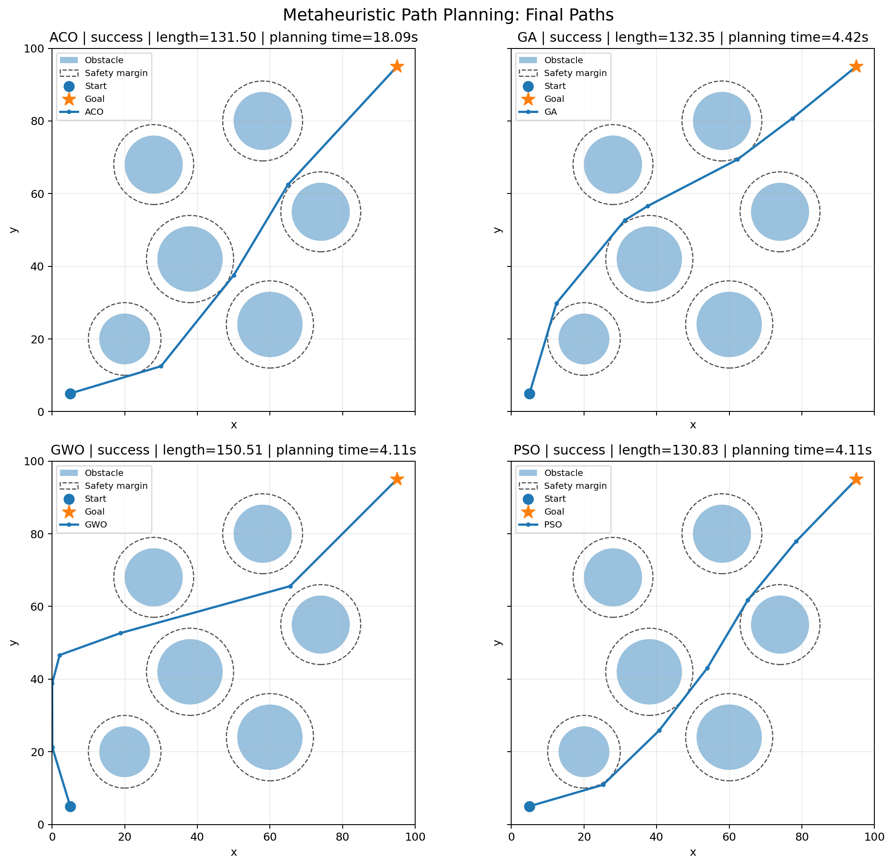
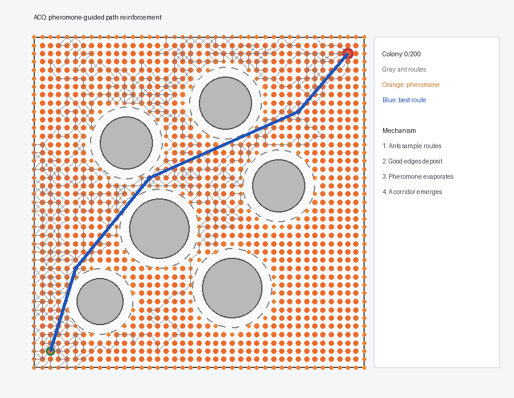
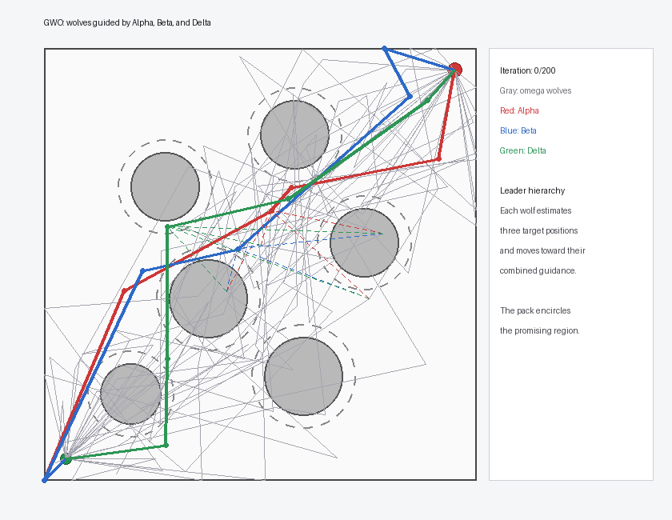
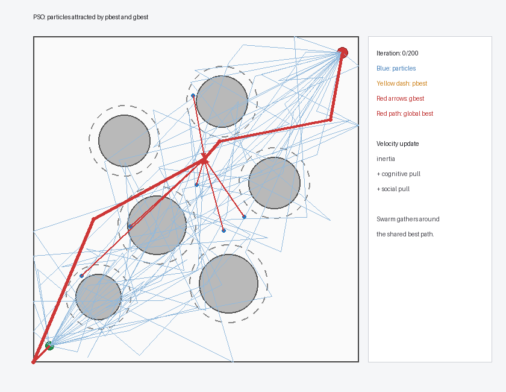

# Metaheuristic Path Planning

> **ACO, GA, GWO, PSO가 동일한 단일 드론 경로 계획 문제를 서로 다른 방식으로 탐색하는 과정을 구현하고 시각화한 프로젝트다.**

본 프로젝트는 메타휴리스틱 알고리즘의 최종 성능 순위를 결정하는 데 목적이 있지 않다. 동일한 지도와 목적함수를 사용하더라도 ACO는 페로몬을 축적하고, GA는 세대를 진화시키며, GWO는 세 리더를 따르고, PSO는 개인·집단 최적해에 이끌린다. 이처럼 **최종 경로보다 그 경로에 도달하는 탐색 과정의 차이**를 이해하는 데 초점을 둔다.

현재 구현은 정적 2차원 환경의 단일 드론을 대상으로 한다. 여기서 ant, chromosome, wolf, particle은 실제 드론이 아니라 하나의 경로 후보 또는 경로를 구성하는 가상 탐색 개체다. 단일 드론 환경에서 각 알고리즘의 기본 구조를 정립한 뒤, 향후 다중 드론 공동 경로 계획으로 확장하는 것을 목표로 한다.

---

## 1. Final Path Comparison

<p align="center">
  
</p>

대표 난수 시드 `42`에서 네 알고리즘 모두 지도 경계를 벗어나지 않고, 실제 장애물과 충돌하지 않으며, 설정한 safety margin을 만족하는 경로를 생성하였다.

| Algorithm | Success | Path length | Planning time* |
|---|---:|---:|---:|
| ACO | True | 131.50 | 18.09 s |
| GA | True | 132.35 | 4.42 s |
| GWO | True | 150.51 | 4.11 s |
| PSO | True | 130.83 | 4.11 s |

\* `Planning time`은 각 알고리즘 내부에서 측정한 CPU 계산 시간이다. 운영체제, 하드웨어, 동시 실행 상태에 따라 실제 체감 시간은 달라질 수 있다.

이 결과는 하나의 대표 실행을 보여주는 것이며 알고리즘의 일반적인 우열을 의미하지 않는다. 특히 GWO는 다른 세 알고리즘과 다른 우회 영역으로 수렴하여 더 긴 경로를 반환하였다. 이는 확률적 메타휴리스틱이 동일한 문제에서도 서로 다른 feasible region에 정착할 수 있음을 보여준다.

---

## 2. Problem Definition

크기 `100 × 100`인 연속 2차원 공간에서 시작점 `(5, 5)`부터 목표점 `(95, 95)`까지 이동하는 충돌 없는 경로를 탐색한다.

```text
Map size       : 100 × 100
Start          : (5, 5)
Goal           : (95, 95)
Obstacles      : 6 circular obstacles
Safety margin  : 3.0
Waypoints      : 5 for GA / GWO / PSO
Random seed    : 42 for the representative run
```

원형 장애물 중심과 반지름은 다음과 같다.

```text
(20, 20), radius 7
(38, 42), radius 9
(60, 24), radius 9
(28, 68), radius 8
(74, 55), radius 8
(58, 80), radius 8
```

실선 원은 실제 장애물을, 점선 원은 장애물 반지름에 safety margin을 더한 금지 영역을 나타낸다.

### Success condition

경로는 다음 조건을 모두 만족할 때 성공으로 판정한다.

- 시작점과 목표점을 정확히 포함한다.
- 모든 경로 좌표가 지도 경계 안에 있다.
- 실제 장애물과 충돌하지 않는다.
- 모든 장애물에 대해 safety margin을 만족한다.

---

## 3. Common Design

### 3.1 Path representation

GA, GWO, PSO는 중간 waypoint 5개의 좌표를 하나의 10차원 실수 벡터로 표현한다.

```text
[x1, y1, x2, y2, x3, y3, x4, y4, x5, y5]
```

이 벡터는 다음 polyline으로 변환된다.

```text
start → waypoint 1 → waypoint 2 → ... → waypoint 5 → goal
```

ACO는 같은 연속 지도를 해상도 `2.5`의 `41 × 41` 격자 그래프로 변환하고, 8방향 연결을 이용해 경로를 구성한다. 탐색이 종료되면 line-of-sight 단순화를 적용하여 불필요한 격자 점을 제거한 뒤 연속 공간에서 다시 검증한다.

### 3.2 Internal objective

Fitness는 독자에게 보여주기 위한 최종 성능 지표가 아니라, 알고리즘이 수많은 후보 경로 중 더 나은 후보를 선택하기 위한 **내부 비용 함수**다. 값이 작을수록 짧고, 안전하며, 부드러운 경로에 가깝다.

```math
J(P)
=
w_L J_{length}
+
w_C J_{collision}
+
w_D J_{clearance}
+
w_S J_{smoothness}
+
w_B J_{boundary}
```

| Term | Meaning | Weight |
|---|---|---:|
| `length` | 전체 polyline 길이 | 1.0 |
| `collision` | 실제 장애물과 교차한 선분 수 | 10,000.0 |
| `clearance` | safety margin 침범 횟수와 침범 깊이 | 100.0 |
| `smoothness` | 연속 선분의 회전각 제곱합 | 5.0 |
| `boundary` | 지도 경계 이탈량 | 10,000.0 |

충돌과 경계 이탈에는 큰 패널티를 부여하여 실행 가능한 경로를 우선하고, 실행 가능한 경로 사이에서는 길이와 굴곡을 줄이도록 구성하였다.

### 3.3 Shared search budget

```text
Population / ants       : 80
Iterations / generations: 200
Candidate attempts      : 16,080
```

GA, GWO, PSO는 동일한 크기의 waypoint population을 반복 평가한다. ACO도 동일한 수의 ant 경로 구성을 시도하지만, 격자에서 목표점까지 노드를 순차적으로 선택하므로 후보 하나를 만드는 계산 과정은 나머지 알고리즘과 다르다.

---

## 4. Algorithm Visualizations

최종 경로만 보면 알고리즘의 차이를 확인하기 어렵다. 따라서 각 GIF는 동일한 결과 표현을 반복하지 않고, 알고리즘 내부에서 후보 경로가 개선되는 고유한 과정을 강조한다.

### 4.1 Ant Colony Optimization

<p align="center">
  
</p>

ACO는 가상의 ant가 시작점에서 목표점까지 격자 경로를 확률적으로 구성하는 방식이다.

```math
p_{ij}
\propto
\tau_{ij}^{\alpha}\eta_{ij}^{\beta}
```

- 회색 선은 현재 colony에서 생성한 ant 경로다.
- 주황색은 격자 노드 주변의 pheromone 강도다.
- 파란색은 현재까지 발견한 최적 경로다.
- 우수한 경로는 pheromone을 추가하고 기존 pheromone은 반복마다 증발한다.

초기에는 경로가 넓게 분산되지만, 반복이 진행될수록 좋은 통로에 pheromone이 누적되어 탐색이 특정 corridor로 집중된다. 본 구현은 Ant System의 핵심 구조를 정적 2차원 경로 계획에 맞게 적용하였다.

구현 파일: [`optimizers/aco.py`](optimizers/aco.py)

---

### 4.2 Genetic Algorithm

<p align="center">
  
</p>

GA에서는 chromosome 하나가 전체 waypoint 경로 하나를 의미한다.

```text
fitness evaluation
→ tournament selection
→ waypoint crossover
→ Gaussian mutation
→ elite survival
```

- 보라색은 교차와 돌연변이로 생성된 offspring이다.
- 주황색은 다음 세대로 그대로 보존된 elite다.
- 초록색은 현재까지의 best-so-far 경로다.

세대가 진행될수록 충돌하거나 불필요하게 긴 경로가 제거되고, 우수한 waypoint 조합이 선택·재결합·변이되면서 경로 집단이 진화한다. 좌표 하나를 분리하지 않도록 `(x, y)` waypoint 블록 단위의 two-point crossover를 사용하였다.

구현 파일: [`optimizers/ga.py`](optimizers/ga.py)

---

### 4.3 Grey Wolf Optimizer

<p align="center">
  
</p>

GWO에서는 wolf 하나가 전체 waypoint 경로 하나를 의미한다. 현재 population에서 가장 좋은 세 후보를 Alpha, Beta, Delta로 지정하고, 나머지 wolf가 세 리더를 함께 참고해 위치를 갱신한다.

```math
\mathbf{X}(t+1)
=
\frac{\mathbf{X}_1+\mathbf{X}_2+\mathbf{X}_3}{3}
```

- 회색은 일반 Omega wolf 경로다.
- 빨간색은 Alpha 경로다.
- 파란색은 Beta 경로다.
- 초록색은 Delta 경로다.

PSO가 하나의 global best를 중심으로 응집하는 것과 달리, GWO는 상위 세 경로의 결합된 정보를 사용한다. 제어계수 `a`는 `2 → 0`으로 감소하여 초반에는 넓게 탐색하고 후반에는 leader 주변의 exploitation을 강화한다.

구현 파일: [`optimizers/gwo.py`](optimizers/gwo.py)

---

### 4.4 Particle Swarm Optimization

<p align="center">
  
</p>

PSO에서는 particle 하나가 전체 waypoint 경로 하나를 의미한다. 각 particle은 자신의 가장 좋은 과거 위치인 `pbest`와 전체 swarm의 가장 좋은 위치인 `gbest`를 기억한다.

```math
\mathbf{v}_i(t+1)
=
w(t)\mathbf{v}_i(t)
+
c_1\mathbf{r}_1\odot(\mathbf{p}_i-\mathbf{x}_i)
+
c_2\mathbf{r}_2\odot(\mathbf{g}-\mathbf{x}_i)
```

- 파란색은 현재 particle 경로다.
- 노란 점선은 particle에서 pbest 방향으로의 인력을 나타낸다.
- 빨간 화살표는 gbest 방향으로의 인력을 나타낸다.
- 굵은 빨간색은 현재 global best 경로다.

각 particle은 자기 경험과 집단 경험을 동시에 참고하며 이동한다. 관성가중치 `w`는 `0.9 → 0.4`로 감소하여 초기의 탐색 범위와 후기의 세밀한 수렴을 조절한다.

구현 파일: [`optimizers/pso.py`](optimizers/pso.py)

---

## 5. Algorithm Comparison

| Algorithm | Search individual | Search space | Main update mechanism |
|---|---|---|---|
| ACO | Ant route | Discrete grid graph | Pheromone + heuristic probability |
| GA | Chromosome | Continuous waypoint vector | Selection + crossover + mutation + elitism |
| GWO | Wolf | Continuous waypoint vector | Alpha + Beta + Delta guidance |
| PSO | Particle | Continuous waypoint vector | Inertia + pbest + gbest |

네 알고리즘은 최종적으로 모두 `(N, 2)` 형태의 연속 좌표 경로를 반환하지만, 후보 경로를 만들고 개선하는 내부 방식은 서로 다르다. 이 차이를 동일한 지도 위에서 직접 관찰할 수 있도록 구현한 것이 본 프로젝트의 핵심이다.

---

## 6. Project Structure

```text
02_Metaheuristics/
├─ README.md
├─ requirements.txt
├─ run_single_comparison.py
│
├─ config/
│  ├─ __init__.py
│  └─ scenario.py
│
├─ optimizers/
│  ├─ __init__.py
│  ├─ aco.py
│  ├─ ga.py
│  ├─ gwo.py
│  └─ pso.py
│
├─ utils/
│  ├─ __init__.py
│  ├─ collision.py
│  ├─ metrics.py
│  ├─ objective.py
│  ├─ optimizer_worker.py
│  ├─ path_utils.py
│  ├─ reporting.py
│  └─ visualization.py
│
└─ results/
   └─ single/
      ├─ path_comparison.png
      ├─ aco_evolution.gif
      ├─ ga_evolution.gif
      ├─ gwo_evolution.gif
      ├─ pso_evolution.gif
      └─ metrics.csv
```

`utils/optimizer_worker.py`는 네 알고리즘을 독립된 Python 프로세스에서 실행하기 위한 내부 실행 도구다. 알고리즘의 핵심 로직은 모두 `optimizers/`에 위치한다.

---

## 7. How to Run

프로젝트 루트에서 필요한 패키지를 설치한다.

```bash
pip install -r requirements.txt
```

네 알고리즘을 동일한 시드와 환경에서 실행하고 비교 이미지와 GIF를 생성한다.

```bash
python run_single_comparison.py
```

다른 난수 시드를 지정할 수 있다.

```bash
python run_single_comparison.py --seed 7
```

GIF 생성 없이 정적 결과만 빠르게 확인하려면 다음을 사용한다.

```bash
python run_single_comparison.py --skip-gifs
```

Matplotlib 결과 창을 함께 확인하려면 다음을 사용한다.

```bash
python run_single_comparison.py --show
```

### Dependencies

```text
numpy >= 1.24
matplotlib >= 3.7
Pillow >= 10.0
```

---

## 8. Limitations and Future Work

현재 구현은 알고리즘의 기본 탐색 구조를 비교하기 위한 기반 프로젝트이므로 다음 한계를 가진다.

- 단일 드론의 정적 2차원 global path planning만 다룬다.
- 드론의 속도, 가속도, 회전 반경과 같은 동역학 제약은 포함하지 않는다.
- GA, GWO, PSO는 고정된 waypoint 수를 사용한다.
- ACO는 격자 해상도에 따라 경로 품질과 계산 비용이 달라진다.
- 목적함수 가중치는 현재 시나리오를 기준으로 설정하였다.
- 메타휴리스틱은 확률적 탐색이므로 전역 최적해를 보장하지 않는다.
- 대표 시드 하나의 결과만 시각화하므로 알고리즘의 일반적인 우열을 주장하지 않는다.

향후 다중 드론으로 확장할 때는 후보해 하나가 여러 드론의 경로를 동시에 포함하도록 표현을 확장하고, 다음 요소를 추가할 수 있다.

- 드론 간 충돌 및 최소 분리 거리
- 시간에 따른 위치와 도착 시각 동기화
- 전체 비행 거리 또는 makespan 최소화
- 임무별 목표점 배정
- 대형 유지와 통신 제약

---

## 9. References

본 구현은 아래 문헌의 핵심 아이디어를 참고하여 정적 2차원 경로 계획 문제에 맞게 재구성하였다. 원 논문의 실험이나 응용 알고리즘 전체를 그대로 재현한 것은 아니다.

1. M. Dorigo, V. Maniezzo, and A. Colorni, “Ant system: Optimization by a colony of cooperating agents,” *IEEE Transactions on Systems, Man, and Cybernetics, Part B*, vol. 26, no. 1, pp. 29–41, 1996. [DOI](https://doi.org/10.1109/3477.484436)
2. C. C. Hsu, R. Y. Hou, and W. Y. Wang, “Path planning for mobile robots based on improved ant colony optimization,” *2013 IEEE International Conference on Systems, Man, and Cybernetics*, pp. 2777–2782, 2013. [DOI](https://doi.org/10.1109/SMC.2013.474)
3. J. H. Holland, *Adaptation in Natural and Artificial Systems*. University of Michigan Press, 1975; MIT Press reprint, 1992.
4. I. Ashiru, C. Czarnecki, and T. Routen, “Characteristics of a genetic based approach to path planning for mobile robots,” *Journal of Network and Computer Applications*, vol. 19, no. 2, pp. 149–169, 1996. [DOI](https://doi.org/10.1006/jnca.1996.0012)
5. S. Mirjalili, S. M. Mirjalili, and A. Lewis, “Grey Wolf Optimizer,” *Advances in Engineering Software*, vol. 69, pp. 46–61, 2014. [DOI](https://doi.org/10.1016/j.advengsoft.2013.12.007)
6. S. Zhang, Y. Zhou, Z. Li, and W. Pan, “Grey wolf optimizer for unmanned combat aerial vehicle path planning,” *Advances in Engineering Software*, vol. 99, pp. 121–136, 2016. [DOI](https://doi.org/10.1016/j.advengsoft.2016.05.015)
7. J. Kennedy and R. Eberhart, “Particle swarm optimization,” *Proceedings of ICNN’95*, vol. 4, pp. 1942–1948, 1995. [DOI](https://doi.org/10.1109/ICNN.1995.488968)
8. Y. Shi and R. Eberhart, “A modified particle swarm optimizer,” *1998 IEEE International Conference on Evolutionary Computation*, pp. 69–73, 1998. [DOI](https://doi.org/10.1109/ICEC.1998.699146)
9. M. S. Alam, M. U. Rafique, and M. U. Khan, “Mobile robot path planning in static environments using particle swarm optimization,” 2020. [arXiv](https://arxiv.org/abs/2008.10000)
