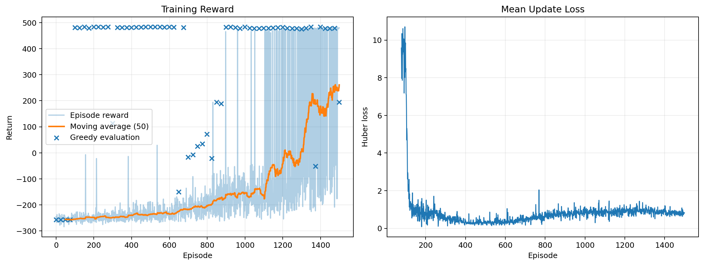
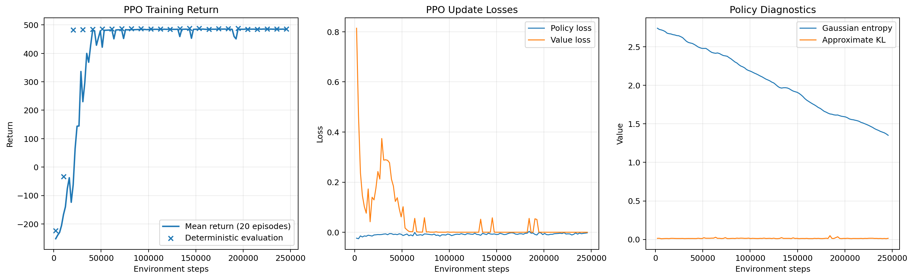

# Reinforcement Learning Path Planning

> DQN과 PPO가 동일한 3차원 도시 환경에서 장애물을 회피하며 목표점까지 이동하는 정책을 학습하고, 이산 위치 제어와 연속 가속도 제어가 만드는 경로 특성을 비교한 프로젝트다.

## 1. 프로젝트 개요

본 프로젝트는 강화학습 알고리즘의 일반적인 우열을 결정하기보다, 동일한 3차원 지도에서 **상태 표현, 행동 공간과 동역학 설계가 학습된 경로에 어떤 차이를 만드는지** 확인하는 데 목적이 있다.

DQN은 `±X`, `±Y`, `±Z`의 여섯 방향 중 하나를 선택해 고정 거리만큼 이동한다. PPO는 3축 연속 가속도를 출력하고, 속도와 관성을 포함한 point-mass dynamics를 통해 이동한다. 따라서 DQN은 계단형·축 정렬 경로를, PPO는 연속적인 상승·순항·하강 경로를 학습한다.

특정 논문의 수치 결과를 그대로 재현한 것이 아니라, 3차원 UAV navigation과 deep reinforcement learning 연구의 문제 정의와 핵심 알고리즘을 학습·비교·시각화가 가능한 규모로 축소하고 재구성한 연구 기반 시뮬레이션 프로젝트다.

<p align="center">
  
</p>

### 주요 구현 내용

- 9개의 높이가 다른 직육면체 건물로 구성된 고정 3차원 도시 환경
- 목표 방향, 현재 운동 상태와 26방향 거리 센서를 결합한 공통 관측 벡터
- experience replay와 target network를 사용하는 DQN 직접 구현
- GAE와 clipped surrogate objective를 사용하는 PPO 직접 구현
- 위치 이동 기반 이산 제어와 가속도 기반 연속 제어 비교
- 학습 로그, 최종 궤적, 행동 기록, 평가 지표와 GIF 자동 생성
- PPO 안정 수렴 이후 불필요한 학습을 줄이기 위한 early stopping

---

## 2. 문제 정의와 공통 설계

### 2.1 실험 환경

크기 `100 × 100 × 100`인 연속 3차원 공간에서 시작점 `(6, 6, 8)`부터 목표점 `(94, 94, 8)`까지 이동하는 충돌 없는 경로를 학습한다. 직접 시작점과 목표점을 잇는 선분은 여러 건물과 교차하며, 건물 사이와 상공에는 이동 가능한 corridor가 존재한다.

시작점 전방의 첫 건물 높이는 `20`으로 설정하고, 나머지 건물은 `30 ~ 55` 범위의 서로 다른 높이를 사용하였다. 이는 시작 직후의 상승 경로를 확보하면서도 중앙 구간에서는 3차원 회피가 필요하도록 구성한 것이다.

| 항목 | 설정 |
|---|---:|
| 작업 공간 | `100 × 100 × 100` |
| 시작점 | `(6, 6, 8)` |
| 목표점 | `(94, 94, 8)` |
| 직육면체 건물 | 9개 |
| 건물 높이 | `20 ~ 55` |
| 에이전트 반지름 | `1.0` |
| 안전 여유 | `2.0` |
| 목표 반경 | `3.0` |
| 센서 범위 | `18.0` |
| 거리 센서 | 26방향 |
| 최대 episode step | `250` |
| 대표 난수 시드 | `42` |

충돌 판정에서는 에이전트 반지름만큼 건물을 팽창시킨 뒤, 현재 위치뿐 아니라 이전 위치와 다음 위치를 잇는 이동 선분 전체를 검사한다. 이를 통해 한 step 사이에 얇은 장애물을 통과하는 tunneling을 방지한다.

### 2.2 상태 표현

두 에이전트는 동일한 36차원 관측 벡터를 사용한다.

$$
s_t=[\Delta p_t,\ d_t,\ m_t,\ u_{t-1},\ l_t^{(1)},\ldots,l_t^{(26)}]\in\mathbb{R}^{36}
$$

| 구성 | 차원 | 의미 |
|---|---:|---|
| `goal_vector` | 3 | 현재 위치에서 목표점까지의 정규화 방향 벡터 |
| `goal_distance` | 1 | 작업 공간 대각선으로 정규화한 목표 거리 |
| `motion` | 3 | DQN의 직전 이동 방향 또는 PPO의 정규화 속도 |
| `previous_control` | 3 | 직전 이산 방향 또는 연속 제어 입력 |
| `ray_distances` | 26 | 건물·경계까지의 정규화 거리 |

26개 ray는 각 축 방향, 면 대각선 방향과 공간 대각선 방향을 포함한다. 장애물이나 작업 공간 경계가 센서 범위 안에 없으면 최대 거리 `18.0`을 반환한다.

### 2.3 행동 공간과 동역학

| 항목 | DQN | PPO |
|---|---|---|
| 행동 공간 | `Discrete(6)` | `Box([-1, 1]^3)` |
| 제어 의미 | `±X`, `±Y`, `±Z` 위치 이동 | 3축 가속도 명령 |
| 위치 step | `2.0` | 속도 적분 결과 |
| 최대 가속도 | 해당 없음 | `0.5` |
| 최대 속도 | 해당 없음 | `2.0` |
| 시간 간격 | 위치 기반 step | `dt = 1.0` |

DQN의 상태 전이는 다음과 같다.

$$
p_{t+1}=p_t+2d(a_t),\qquad d(a_t)\in\{\pm e_x,\pm e_y,\pm e_z\}
$$

PPO는 연속 action을 가속도로 변환한 뒤 속도와 위치를 갱신한다.

$$
a_t=0.5u_t,\qquad
v_{t+1}=\mathrm{clip}_{\lVert v\rVert\le2}(v_t+a_t),\qquad
p_{t+1}=p_t+v_{t+1}
$$

두 알고리즘은 지도, 시작점·목표점, 관측 구조, 충돌 조건과 보상 설계를 공유하지만 행동 공간과 상태 전이 모델은 다르다. 따라서 본 실험은 완전히 동일한 제어 조건에서의 optimizer 순위가 아니라, **이산 행동 정책과 연속 제어 정책이 만드는 경로 특성의 비교**로 해석한다.

### 2.4 보상과 종료 조건

충돌이나 작업 공간 이탈이 없을 때 step 보상은 다음과 같이 계산한다.

$$
r_t=2(d_{t-1}-d_t)-0.1
-0.5\max(0,2-c_t)
-0.02\lVert u_t-u_{t-1}\rVert_2^2
+250\mathbb{1}[d_t\le3]
$$

| 항 | 의미 | 설정 |
|---|---|---:|
| 목표 진행 | 이전 step 대비 목표 거리 감소 | `2.0 × progress` |
| step 비용 | 불필요한 이동 억제 | `-0.1` |
| 안전 여유 비용 | clearance가 `2.0`보다 작을 때 적용 | `-0.5 × violation` |
| 제어 변화 비용 | 연속 또는 이산 control의 급격한 변화 억제 | `-0.02 × change²` |
| 목표 도달 | 목표 반경 `3.0` 이내 진입 | `+250` |
| 충돌·경계 이탈 | 즉시 종료 | `-250` |

안전 여유 `2.0`은 hard constraint가 아니라 reward shaping을 위한 soft margin이다. 실제 충돌은 에이전트 반지름을 반영한 건물 표면과 이동 선분의 교차 여부로 별도 판정한다.

---

## 3. 구현 알고리즘

### 3.1 Deep Q-Network

DQN은 각 상태에서 여섯 개 이산 행동의 action value를 추정한다.

$$
y_t=r_t+\gamma(1-\mathrm{done})\max_{a'}Q_{\mathrm{target}}(s_{t+1},a')
$$

$$
L_{\mathrm{DQN}}=\mathrm{Huber}\left(Q_{\mathrm{online}}(s_t,a_t),y_t\right)
$$

- `[256, 256]` MLP와 ReLU activation을 사용한다.
- replay buffer에 transition을 저장하고 무작위 minibatch로 학습한다.
- online network와 별도의 target network를 두고 `1,000` step마다 동기화한다.
- epsilon-greedy exploration을 `1.0 → 0.05`로 선형 감소시킨다.
- gradient norm을 `10.0`으로 제한한다.
- 총 `1,500` episode를 학습하며, deterministic evaluation return이 가장 높은 성공 checkpoint를 저장한다.

이산 위치 이동은 구현과 해석이 단순하지만, 축 방향으로만 이동하므로 회전이 많은 계단형 경로가 생성된다.

구현 파일: [`agents/dqn.py`](agents/dqn.py)

### 3.2 Proximal Policy Optimization

PPO는 actor가 연속 행동 분포를 생성하고 critic이 상태 가치를 추정하는 on-policy actor-critic 방식이다. actor는 Gaussian distribution에서 action을 샘플링한 뒤 `tanh` 변환을 적용해 모든 제어 입력을 `[-1, 1]^3` 안에 유지한다.

$$
L^{\mathrm{CLIP}}(\theta)=
\mathbb{E}_t\left[
\min\left(
\rho_t(\theta)\hat A_t,
\mathrm{clip}(\rho_t(\theta),1-\epsilon,1+\epsilon)\hat A_t
\right)
\right]
$$

$$
\delta_t=r_t+\gamma V(s_{t+1})-V(s_t),\qquad
\hat A_t=\delta_t+\gamma\lambda\hat A_{t+1}
$$

- actor와 critic 모두 `[256, 256]` MLP를 사용한다.
- `2,048` step의 on-policy rollout마다 GAE를 계산한다.
- minibatch 크기 `256`, 최대 `10` epoch로 clipped policy와 value objective를 갱신한다.
- entropy bonus, gradient clipping과 target KL 기반 epoch 중단을 사용한다.
- 최대 학습 예산은 `500,000` environment step이다.
- `200,000` step 이후 return `475` 이상, 성공, `120` step 이하 조건을 5회 연속 만족하면 early stopping한다.
- deterministic evaluation return이 가장 높은 성공 checkpoint를 최종 평가 모델로 사용한다.

가속도와 속도 적분을 포함하므로 action 자체에 변화가 있더라도 위치 궤적은 연속적으로 연결된다. 이 구조는 DQN보다 부드러운 3차원 경로를 생성할 수 있지만, 더 복잡한 연속 제어 학습을 요구한다.

구현 파일: [`agents/ppo.py`](agents/ppo.py)

<p align="center">
  
</p>

---

## 4. 실험 결과

아래 결과는 동일한 시나리오와 `seed=42`에서 얻은 단일 대표 실행이다. 최종 평가는 학습 마지막 model이 아니라, 성공한 deterministic evaluation checkpoint 중 return이 가장 높았던 `best_model.pt`를 사용하였다.

| 지표 | DQN | PPO |
|---|---:|---:|
| 성공 | True | True |
| Episode return | 484.26 | **488.28** |
| Episode steps | 87 | **74** |
| 최종 목표 거리 | 2.00 | **1.35** |
| 경로 길이 | 174.00 | **146.30** |
| 경로 효율 | 0.715 | **0.851** |
| 최소 여유 거리 | 1.24 | **1.69** |
| 누적 회전각 | 2,610.00° | **390.26°** |
| 평균 회전각 | 30.35° | **5.35°** |
| 최대 회전각 | 90.00° | **15.64°** |
| Trajectory roughness | 232.00 | **4.30** |
| Control variation | 41.01 | **24.15** |

PPO는 DQN보다 경로 길이를 약 `15.9%`, episode step을 약 `14.9%` 줄였다. 누적 회전각은 약 `85.0%`, trajectory roughness는 약 `98.1%` 감소했으며, 최소 장애물 여유 거리는 약 `0.45`만큼 증가하였다.

DQN도 충돌 없이 목표에 도달했지만 이산 6방향 행동의 영향으로 직각 회전이 반복되는 계단형 경로를 생성하였다. PPO는 연속 가속도와 속도 상태를 이용해 건물 상공과 corridor를 연결하는 더 짧고 부드러운 궤적을 학습하였다. 이러한 차이는 알고리즘뿐 아니라 행동 공간과 동역학 설계의 영향도 포함한다.

PPO는 최대 `500,000` step으로 설정했지만, update `120`, global step `245,760`에서 early stopping 조건을 만족해 학습을 종료하였다. 최종 평가에 사용된 PPO best checkpoint는 global step `153,600`에서 저장되었으며, DQN best checkpoint는 global step `54,190`에서 저장되었다.

### 4.1 DQN 학습 과정

<p align="center">
  
</p>

DQN의 실제 training episode는 epsilon-greedy exploration 때문에 후반까지 큰 분산을 보인다. 반면 주기적으로 수행한 greedy evaluation은 정책 자체의 성능을 별도로 보여준다. epsilon이 감소하면서 moving average와 training success가 후반부에 상승하였다.

### 4.2 PPO 학습 과정

<p align="center">
  
</p>

PPO는 초기 exploration 구간을 지난 뒤 deterministic evaluation과 최근 20 episode의 성공률이 빠르게 안정되었다. policy loss, value loss, entropy와 approximate KL을 함께 기록해 policy update의 크기와 exploration 감소를 확인하였다.

학습 시간은 PyTorch device, GPU 종류와 실행 환경에 따라 달라지므로 절대적인 알고리즘 속도 비교 지표로 사용하지 않는다.

---

## 5. 실행 방법과 프로젝트 구조

### 5.1 설치 및 실행

```bash
python -m venv .venv
pip install -r requirements.txt
```

DQN과 PPO를 순차적으로 모두 학습한다.

```bash
python train.py
```

개별 알고리즘만 학습한다.

```bash
python train.py --algorithm dqn
python train.py --algorithm ppo
```

학습된 DQN과 PPO best model을 평가하고 개별·비교 PNG와 GIF를 생성한다.

```bash
python evaluate.py
```

개별 모델 평가 또는 GIF 생성을 생략할 수 있다.

```bash
python evaluate.py --algorithm dqn
python evaluate.py --algorithm ppo
python evaluate.py --no-gif
```

기본 device는 `auto`이며 CUDA를 사용할 수 있으면 GPU를 선택한다. CPU를 명시하려면 다음과 같이 실행한다.

```bash
python train.py --device cpu
python evaluate.py --device cpu
```

### 5.2 테스트

```bash
python -m pytest -q
```

공통 환경, 26방향 센서, 선분 충돌, 이산·연속 동역학, replay buffer, GAE, checkpoint 저장과 평가 지표를 검증하는 27개 테스트가 구성되어 있다.

### 5.3 프로젝트 구조

```text
03_Reinforcement_Learning/
├─ agents/
│  ├─ dqn.py
│  └─ ppo.py
├─ config/
│  └─ scenario.py
├─ core/
│  ├─ environment.py
│  └─ visualization.py
├─ models/
│  ├─ dqn/
│  │  ├─ best_model.pt
│  │  ├─ model.pt
│  │  └─ checkpoints/
│  └─ ppo/
│     ├─ best_model.pt
│     ├─ model.pt
│     └─ checkpoints/
├─ results/
│  ├─ dqn/
│  ├─ ppo/
│  └─ comparison/
├─ tests/
├─ train.py
├─ evaluate.py
├─ requirements.txt
└─ README.md
```

`train.py`는 model weight와 checkpoint를 `models/`에, 학습 로그와 학습 곡선을 `results/`에 저장한다. `evaluate.py`는 각 `best_model.pt`를 불러와 metrics, trajectory, action 기록, 정적 이미지와 GIF를 생성한다.

---

## 6. 구현 범위와 한계

- 고정된 시작점·목표점과 정적 직육면체 건물을 사용하는 단일 3차원 시나리오다.
- 관측은 목표 정보, 현재 운동 상태와 26방향 거리 센서로 제한되며 완전한 3차원 map을 입력하지 않는다.
- DQN과 PPO는 행동 공간과 동역학이 다르므로 결과 차이를 순수한 학습 알고리즘의 우열로만 해석할 수 없다.
- 안전 여유는 soft reward penalty이며 `minimum_clearance ≥ 2.0`을 강제하는 hard constraint가 아니다.
- 목표 도달은 위치 기준으로만 판정하며, 목표점에서 정지하거나 최종 속도를 제한하는 조건은 포함하지 않는다.
- PPO dynamics는 질점의 가속도·속도만 표현하며 UAV attitude, 회전율, 추진기, 에너지, 중력, 바람과 센서 잡음은 모델링하지 않는다.
- 동적 장애물, online map update, sim-to-real transfer와 실제 비행 제어는 포함하지 않는다.
- 대표 시드 하나의 결과이며, 여러 seed와 다양한 지도에 대한 통계적 일반화 성능은 평가하지 않았다.
- 특정 논문의 전체 실험이나 실제 UAV system을 그대로 재현한 구현이 아니다.

---

## 7. 참고문헌

본 프로젝트는 아래 연구의 강화학습 알고리즘, 3차원 UAV navigation과 smooth control 관련 핵심 개념을 공통 시뮬레이션 환경에 맞게 재구성하였다.

1. V. Mnih et al., “Human-level control through deep reinforcement learning,” *Nature*, vol. 518, pp. 529–533, 2015. [DOI](https://doi.org/10.1038/nature14236)
2. J. Schulman, P. Moritz, S. Levine, M. Jordan, and P. Abbeel, “High-Dimensional Continuous Control Using Generalized Advantage Estimation,” 2015. [arXiv](https://arxiv.org/abs/1506.02438)
3. J. Schulman, F. Wolski, P. Dhariwal, A. Radford, and O. Klimov, “Proximal Policy Optimization Algorithms,” 2017. [arXiv](https://arxiv.org/abs/1707.06347)
4. O. Bouhamed, H. Ghazzai, H. Besbes, and Y. Massoud, “Autonomous UAV Navigation: A DDPG-based Deep Reinforcement Learning Approach,” 2020. [arXiv](https://arxiv.org/abs/2003.10923)
5. S. Mysore, B. Mabsout, R. Mancuso, and K. Saenko, “Regularizing Action Policies for Smooth Control with Reinforcement Learning,” 2020. [arXiv](https://arxiv.org/abs/2012.06644)
