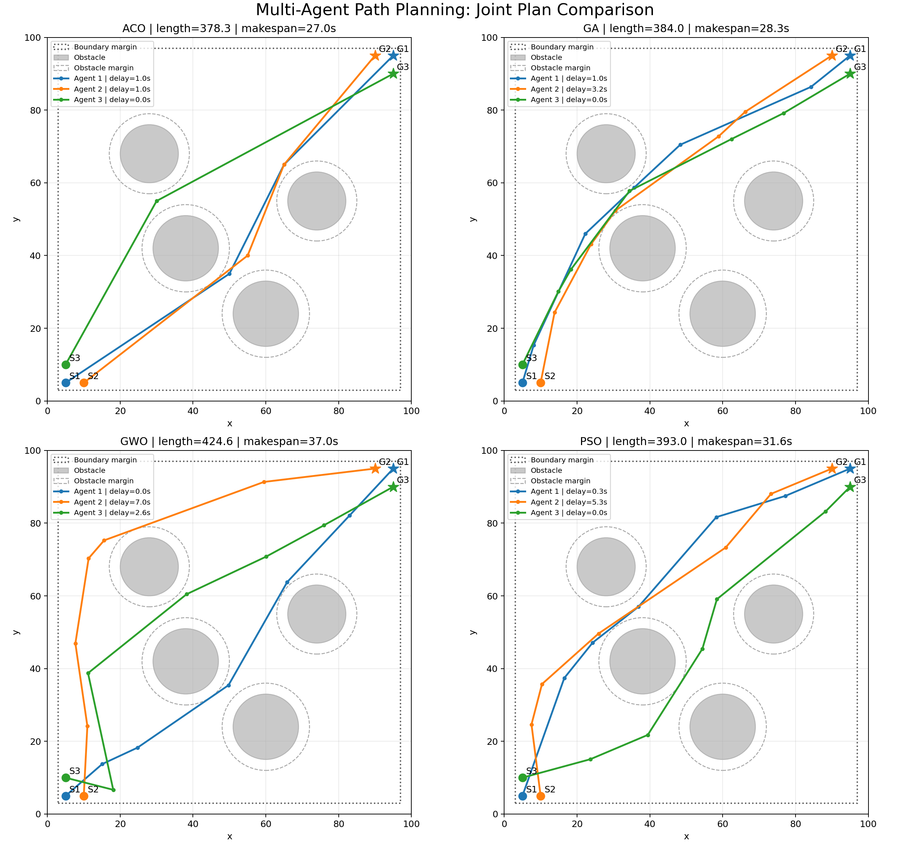
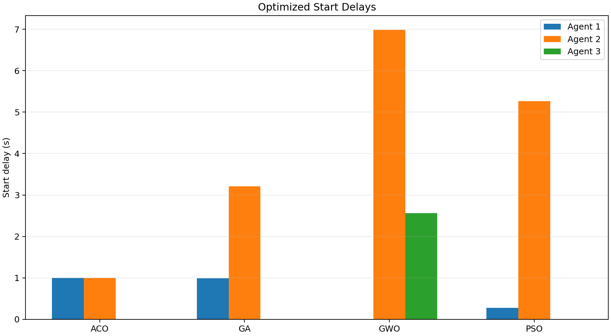
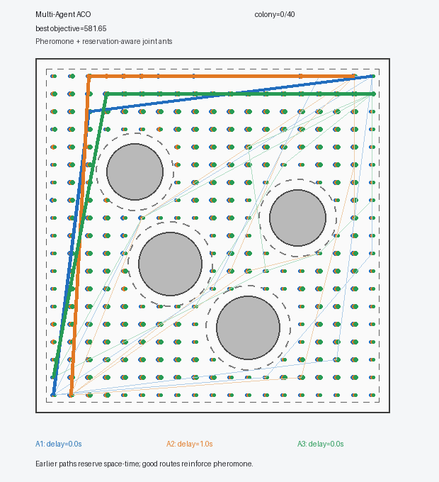
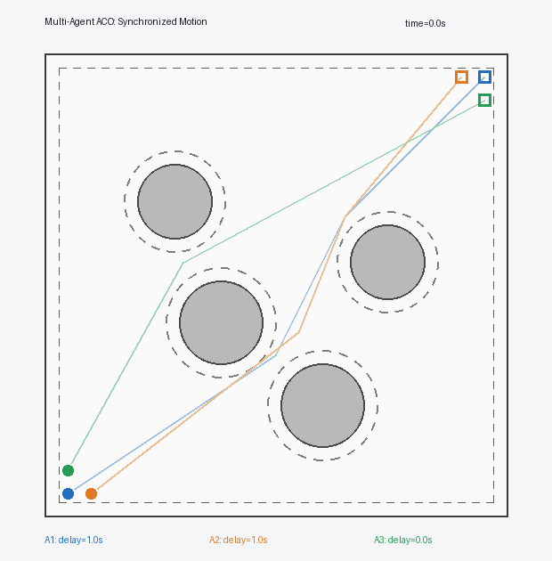
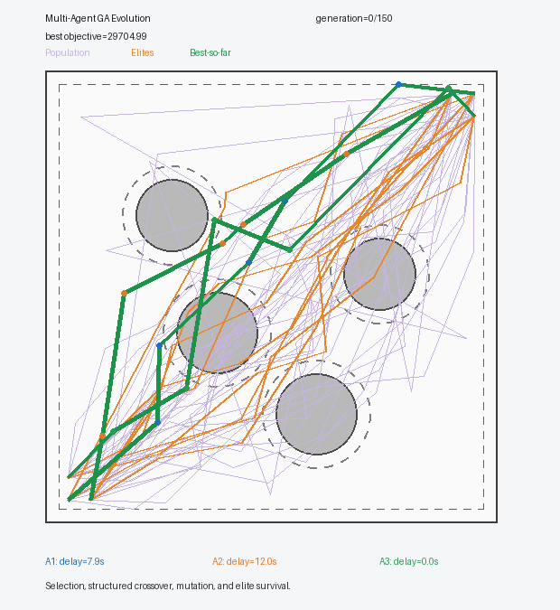
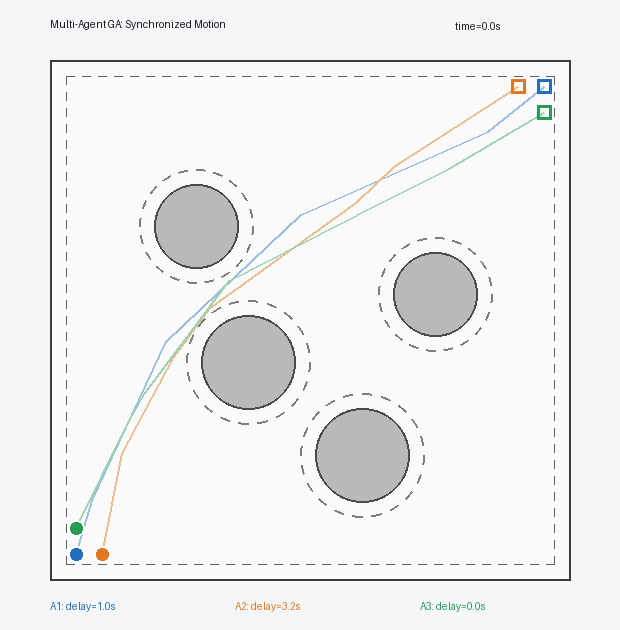
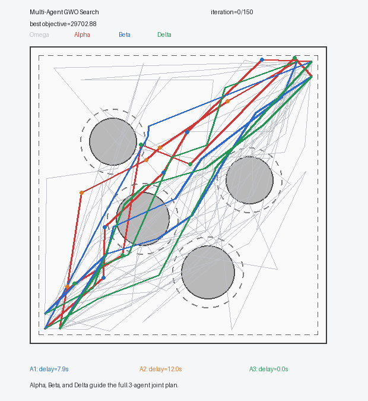
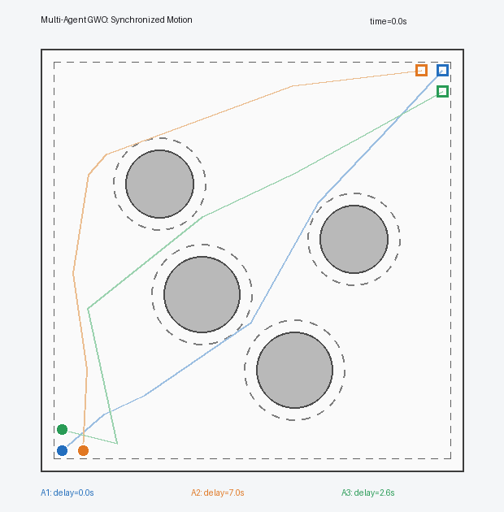
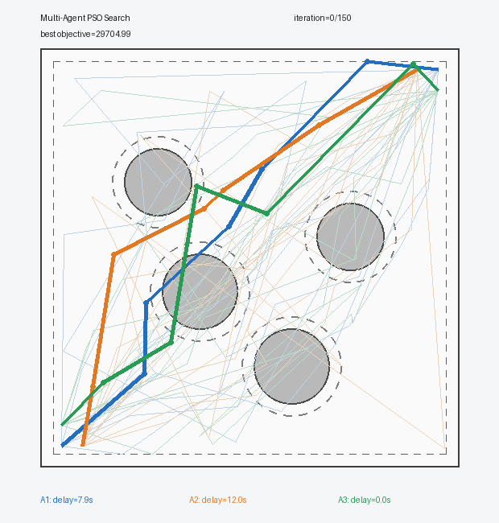

# Multi-Agent Path Planning

> ACO, GA, GWO, PSO를 이용해 세 에이전트의 공간 경로와 출발 시각을 함께 최적화하는 중앙집중식 다중 에이전트 경로 계획 시뮬레이션이다.

## 1. 프로젝트 개요

단일 에이전트 경로 계획과 달리 다중 에이전트 환경에서는 각 에이전트가 장애물을 피하는 동시에, 같은 공간을 비슷한 시각에 점유해 발생하는 충돌도 방지해야 한다.

본 프로젝트는 서로 다른 시작점과 목표점을 가진 세 에이전트를 하나의 중앙 계획기가 함께 다루는 **centralized cooperative path planning** 문제를 구성한다. GA, GWO, PSO는 세 경로와 출발 딜레이를 하나의 33차원 공동 후보로 최적화하며, ACO는 격자 경로와 시공간 예약 정보를 이용해 공동 계획을 순차적으로 생성한다.

특정 논문의 수치 결과를 재현한 것이 아니라, MAPF, cooperative pathfinding, continuous-time collision avoidance와 다중 UAV 메타휴리스틱 연구의 핵심 개념을 공통 2차원 시뮬레이션으로 축소·재구성한 프로젝트다.

<p align="center">
  
</p>

<p align="center">
  
</p>

### 주요 구현 내용

- 세 에이전트의 경로와 출발 딜레이를 함께 결정하는 공동 최적화
- 장애물, 지도 경계, 에이전트 간 충돌과 최소 분리 거리 검증
- 경로 길이, makespan, smoothness와 경로 품질을 결합한 목적함수
- 네 알고리즘의 탐색 과정과 동시 이동 애니메이션
- 동일 시나리오와 공통 지표를 이용한 대표 실행 비교

---

## 2. 문제 정의와 공통 설계

### 2.1 실험 환경

| 항목 | 설정 |
|---|---:|
| 에이전트 수 | 3 |
| 지도 크기 | `100 × 100` |
| 정적 원형 장애물 | 4개 |
| 에이전트당 waypoint | 5개 |
| 연속형 공동 후보 차원 | 33 |
| 이동 속도 | `5.0` |
| 에이전트 반지름 | `1.0` |
| 최소 에이전트 분리 거리 | `3.0` |
| 최대 출발 딜레이 | `15.0 s` |
| 장애물·지도 경계 안전 여유 | `3.0` |
| 최종 검증 시간 간격 | `0.1 s` |

```text
Agent 1: (5, 5)  → (95, 95)
Agent 2: (10, 5) → (90, 95)
Agent 3: (5, 10) → (95, 90)
```

```text
Obstacle 1: center=(38, 42), radius=9
Obstacle 2: center=(60, 24), radius=9
Obstacle 3: center=(28, 68), radius=8
Obstacle 4: center=(74, 55), radius=8
```

지도와 에이전트 설정은 `config/scenario.py`에서 변경할 수 있다.

### 2.2 공동 계획 표현

에이전트 $i$의 경로는 시작점, 다섯 개의 중간 waypoint, 목표점으로 표현한다.

$$
P_i=[s_i,w_{i,1},\ldots,w_{i,5},g_i]
$$

연속형 알고리즘의 후보 하나는 모든 waypoint 좌표와 출발 딜레이로 구성된다.

$$
D=N(2K+1)=3(2\times5+1)=33
$$

공통 시간 이동에 따른 중복 해를 제거하기 위해 출발 딜레이를 정규화한다.

$$
\tau_i'=\mathrm{clip}\left(\tau_i-\min_j\tau_j,0,\tau_{\max}\right)
$$

따라서 최소 한 에이전트는 항상 `0초`에 출발한다.

### 2.3 시간 모델과 안전 조건

각 에이전트는 자신의 polyline을 일정한 속도로 이동하며, 출발 전에는 시작점에, 도착 후에는 목표점에 머문다.

$$
d_{ij}(t)=\lVert q_i(t)-q_j(t)\rVert_2
$$

물리적 충돌 거리와 운항 안전거리는 다음과 같이 구분한다.

$$
d_{ij}(t)\ge 2r=2.0,\qquad d_{ij}(t)\ge d_{\min}=3.0
$$

장애물 clearance는 경로 선분과 장애물 중심 사이의 최소 거리에서 장애물 반지름을 뺀 값으로 계산한다.

$$
c_{i,k,o}=\mathrm{dist}(\overline{p_{i,k}p_{i,k+1}},c_o)-R_o
$$

### 2.4 공동 목적함수

$$
\begin{aligned}
J={}&w_LJ_L+w_{oc}J_{oc}+w_{om}J_{om}+w_{ac}J_{ac}+w_{as}J_{as}\\
&+w_sJ_s+w_{bt}J_{bt}+w_{ws}J_{ws}+w_bJ_b+w_dJ_d+w_mJ_m
\end{aligned}
$$

| 항 | 의미 | 가중치 |
|---|---|---:|
| `J_L` | 전체 경로 길이 | `1` |
| `J_oc`, `J_om` | 장애물 충돌·안전 여유 위반 | `10,000`, `100` |
| `J_ac`, `J_as` | 에이전트 충돌·분리 거리 위반 | `15,000`, `500` |
| `J_s` | 회전각 기반 smoothness | `5` |
| `J_bt`, `J_ws` | backtracking·waypoint 간격 불균형 | `100`, `200` |
| `J_b` | 지도 경계 위반 | `10,000` |
| `J_d`, `J_m` | 출발 딜레이 합·makespan | `1`, `2` |

ACO는 격자 이동과 line-of-sight 단순화로 경로 순서가 구조적으로 결정되므로 backtracking과 waypoint spacing을 내부 최적화 비용에 사용하지 않는다. 알고리즘별 목적함수 절댓값 대신 최종 성공 여부와 공통 물리 지표를 비교한다.

---

## 3. 구현 알고리즘

### 3.1 Ant Colony Optimization

ACO는 `21 × 21`의 8-connected grid에서 공동 계획을 구성한다. Joint ant는 에이전트 우선순위를 정하고, 먼저 생성한 궤적을 시공간 예약 정보로 저장한 뒤 다음 에이전트의 경로와 딜레이를 선택한다.

$$
P_{uv}^{(i)}\propto\left(\tau_{uv}^{(i)}\right)^\alpha\left(\eta_{uv}^{(i)}\right)^\beta R_{uv}^{(i)}(t)
$$

완성된 격자 경로에는 장애물 clearance를 유지하는 line-of-sight 단순화를 적용한다.

<table>
  <tr><th width="50%">Search Evolution</th><th width="50%">Synchronized Motion</th></tr>
  <tr>
    <td></td>
    <td></td>
  </tr>
  <tr>
    <td align="center">Pheromone reinforcement and reservation-aware path construction</td>
    <td align="center">Collision-free execution with compact spatial and temporal coordination</td>
  </tr>
</table>

### 3.2 Genetic Algorithm

Chromosome 하나가 세 에이전트의 waypoint와 출발 딜레이를 모두 포함한다. 세대마다 tournament selection, structured crossover, Gaussian mutation과 elite survival을 수행한다.

- `agent-level crossover`: 에이전트의 전체 경로·딜레이 블록 교환
- `waypoint-level crossover`: 에이전트 내부 waypoint 구간 교환
- 경로 좌표와 시간 gene에 서로 다른 mutation scale 적용

<table>
  <tr><th width="50%">Search Evolution</th><th width="50%">Synchronized Motion</th></tr>
  <tr>
    <td></td>
    <td></td>
  </tr>
  <tr>
    <td align="center">Selection, structured crossover, mutation, and elite survival</td>
    <td align="center">Smooth coordinated motion generated by the evolved joint plan</td>
  </tr>
</table>

### 3.3 Grey Wolf Optimizer

Wolf 하나가 하나의 완전한 공동 계획을 나타내며 Alpha, Beta, Delta가 나머지 wolf의 탐색 방향을 결정한다.

$$
D_{\alpha}=\lvert C_1X_{\alpha}-X\rvert,\qquad X_1=X_{\alpha}-A_1D_{\alpha}
$$

$$
X^{t+1}=\frac{X_1+X_2+X_3}{3}
$$

탐색 중 발견된 최고 세 해를 best-so-far leader archive로 유지하고, 지도 밖 좌표에는 reflection repair를 적용한다.

<table>
  <tr><th width="50%">Search Evolution</th><th width="50%">Synchronized Motion</th></tr>
  <tr>
    <td></td>
    <td></td>
  </tr>
  <tr>
    <td align="center">Alpha, Beta, and Delta guide the full joint plan</td>
    <td align="center">Feasible execution using larger detours and temporal separation</td>
  </tr>
</table>

### 3.4 Particle Swarm Optimization

Particle 하나가 세 에이전트의 전체 공동 계획을 나타내며, 각 particle은 자신의 `pbest`와 swarm의 `gbest`를 이용해 경로와 딜레이를 함께 갱신한다.

$$
v_i^{t+1}=\omega v_i^t+c_1r_1(p_i^t-x_i^t)+c_2r_2(g^t-x_i^t)
$$

$$
x_i^{t+1}=x_i^t+v_i^{t+1}
$$

초기 swarm에는 직선 경로, 곡선형 corridor와 무작위 후보를 함께 사용한다.

<table>
  <tr><th width="50%">Search Evolution</th><th width="50%">Synchronized Motion</th></tr>
  <tr>
    <td></td>
    <td></td>
  </tr>
  <tr>
    <td align="center">Particles update joint plans using personal and global bests</td>
    <td align="center">Conservative coordination with the largest inter-agent clearance</td>
  </tr>
</table>

---

## 4. 실험 결과

아래 결과는 동일한 시나리오와 `seed=42`에서 얻은 단일 대표 실행이다.

| 알고리즘 | 성공 | 경로 길이 | Makespan | 계산 시간 | 최소 에이전트 거리 | 딜레이 합 |
|---|---:|---:|---:|---:|---:|---:|
| ACO | True | **378.339** | **27.010 s** | **7.257 s** | 3.344 | **2.000 s** |
| GA | True | 384.031 | 28.347 s | 10.783 s | 3.905 | 4.206 s |
| GWO | True | 424.562 | 36.955 s | 10.350 s | 3.289 | 9.548 s |
| PSO | True | 392.966 | 31.603 s | 10.144 s | **4.605** | 5.540 s |

모든 알고리즘은 장애물, 지도 경계, 에이전트 간 충돌 조건을 만족하였다. ACO는 가장 짧은 경로와 makespan을 기록했고, GA는 가장 매끄러운 연속형 경로를 생성하였다. PSO는 가장 큰 에이전트 간 최소 거리를 확보했으며, GWO는 더 긴 우회와 출발 지연을 사용하였다.

계산 시간은 후보 생성 방식과 평가 횟수가 서로 다르므로 절대적인 복잡도 순위로 해석하지 않는다. 일반적인 우열을 판단하려면 여러 난수 시드와 시나리오를 사용한 반복 실험이 필요하다.

---

## 5. 실행 방법과 프로젝트 구조

### 5.1 설치 및 실행

```bash
pip install -r requirements.txt
```

개별 알고리즘 실행:

```bash
python run_aco.py
python run_ga.py
python run_gwo.py
python run_pso.py
```

GIF 없이 빠르게 실행하려면 `--skip-gifs`를 사용한다.

기존 결과를 비교하거나 같은 seed로 모두 다시 실행한다.

```bash
python run_comparison.py
python run_comparison.py --rerun --seed 42
```

### 5.2 테스트

```bash
python -m unittest discover -s tests -v
```

공통 환경, 충돌 판정, 경계 제약, 네 최적화 알고리즘과 비교 결과를 검증하는 29개 테스트가 구성되어 있다.

### 5.3 프로젝트 구조

```text
04_Multi_Agent_Path_Planning/
├─ config/
│  └─ scenario.py
├─ optimizers/
│  ├─ aco.py
│  ├─ ga.py
│  ├─ gwo.py
│  └─ pso.py
├─ utils/
│  ├─ collision.py
│  ├─ metrics.py
│  ├─ objective.py
│  ├─ path_utils.py
│  ├─ reporting.py
│  └─ visualization.py
├─ tests/
├─ results/
│  ├─ aco/
│  ├─ ga/
│  ├─ gwo/
│  ├─ pso/
│  └─ comparison/
├─ run_aco.py
├─ run_ga.py
├─ run_gwo.py
├─ run_pso.py
├─ run_comparison.py
├─ requirements.txt
└─ README.md
```

---

## 6. 구현 범위와 한계

- 2차원 정적 원형 장애물 환경을 사용한다.
- 모든 에이전트는 같은 일정 속도로 이동한다.
- 중앙 계획기가 모든 경로와 출발 시각을 오프라인으로 결정한다.
- 충돌 검증은 `0.1초` 간격 시간축을 사용하므로 엄밀한 연속시간 충돌 검사의 근사다.
- 실제 UAV의 가속도, 회전율, 에너지, 통신 단절과 동적 장애물은 포함하지 않는다.
- 특정 논문의 완전한 재현이나 대규모 MAPF benchmark를 목표로 하지 않는다.

---

## 7. 참고문헌

본 프로젝트는 아래 연구의 문제 정의와 핵심 알고리즘을 공통 시뮬레이션 환경에 맞게 재구성하였다.

1. R. Stern et al., “Multi-Agent Pathfinding: Definitions, Variants, and Benchmarks,” *Proceedings of the International Symposium on Combinatorial Search*, vol. 10, no. 1, pp. 151–158, 2021. [DOI](https://doi.org/10.1609/socs.v10i1.18510)
2. D. Silver, “Cooperative Pathfinding,” *Proceedings of the AAAI Conference on Artificial Intelligence and Interactive Digital Entertainment*, vol. 1, no. 1, pp. 117–122, 2005. [DOI](https://doi.org/10.1609/aiide.v1i1.18726)
3. M. Phillips and M. Likhachev, “SIPP: Safe Interval Path Planning for Dynamic Environments,” *IEEE International Conference on Robotics and Automation*, pp. 5628–5635, 2011. [DOI](https://doi.org/10.1109/ICRA.2011.5980306)
4. A. Andreychuk, K. Yakovlev, D. Atzmon, and R. Stern, “Multi-Agent Pathfinding with Continuous Time,” *Proceedings of IJCAI*, pp. 39–45, 2019. [DOI](https://doi.org/10.24963/ijcai.2019/6)
5. J. Kennedy and R. Eberhart, “Particle Swarm Optimization,” *Proceedings of ICNN*, vol. 4, pp. 1942–1948, 1995. [DOI](https://doi.org/10.1109/ICNN.1995.488968)
6. Z. Shao, F. Yan, Z. Zhou, and X. Zhu, “Path Planning for Multi-UAV Formation Rendezvous Based on Distributed Cooperative Particle Swarm Optimization,” *Applied Sciences*, vol. 9, no. 13, 2621, 2019. [DOI](https://doi.org/10.3390/app9132621)
7. Y. Eun and H. Bang, “Cooperative Task Assignment/Path Planning of Multiple Unmanned Aerial Vehicles Using Genetic Algorithms,” *Journal of Aircraft*, vol. 46, no. 1, pp. 338–343, 2009. [DOI](https://doi.org/10.2514/1.38510)
8. S. Mirjalili, S. M. Mirjalili, and A. Lewis, “Grey Wolf Optimizer,” *Advances in Engineering Software*, vol. 69, pp. 46–61, 2014. [DOI](https://doi.org/10.1016/j.advengsoft.2013.12.007)
9. M. Radmanesh, M. Kumar, P. H. Guentert, and M. Sarim, “Grey Wolf Optimization Based Sense and Avoid Algorithm in a Bayesian Framework for Multiple UAV Path Planning in an Uncertain Environment,” *Aerospace Science and Technology*, vol. 77, pp. 168–179, 2018. [DOI](https://doi.org/10.1016/j.ast.2018.02.031)
10. M. Dorigo and L. M. Gambardella, “Ant Colony System: A Cooperative Learning Approach to the Traveling Salesman Problem,” *IEEE Transactions on Evolutionary Computation*, vol. 1, no. 1, pp. 53–66, 1997. [DOI](https://doi.org/10.1109/4235.585892)
11. Y. Zhang, F. Wang, F. Fu, and Z. Su, “Multi-AGV Path Planning for Indoor Factory by Using Prioritized Planning and Improved Ant Algorithm,” *Journal of Engineering and Technological Sciences*, vol. 50, no. 4, pp. 534–547, 2018. [DOI](https://doi.org/10.5614/j.eng.technol.sci.2018.50.4.6)
