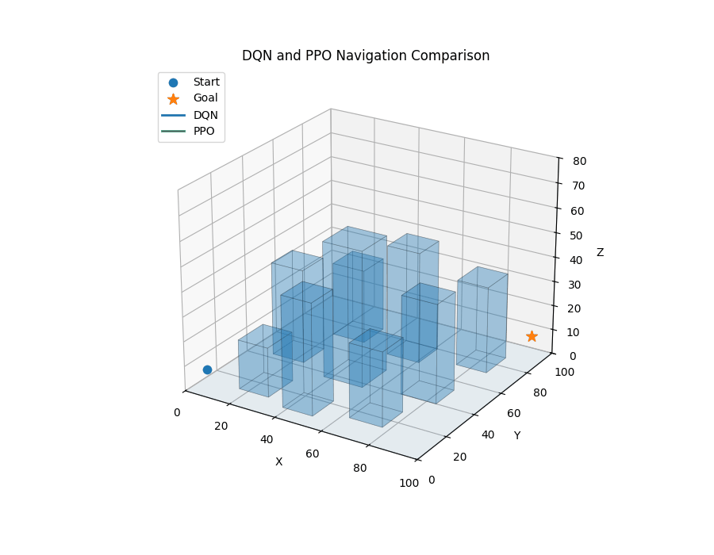
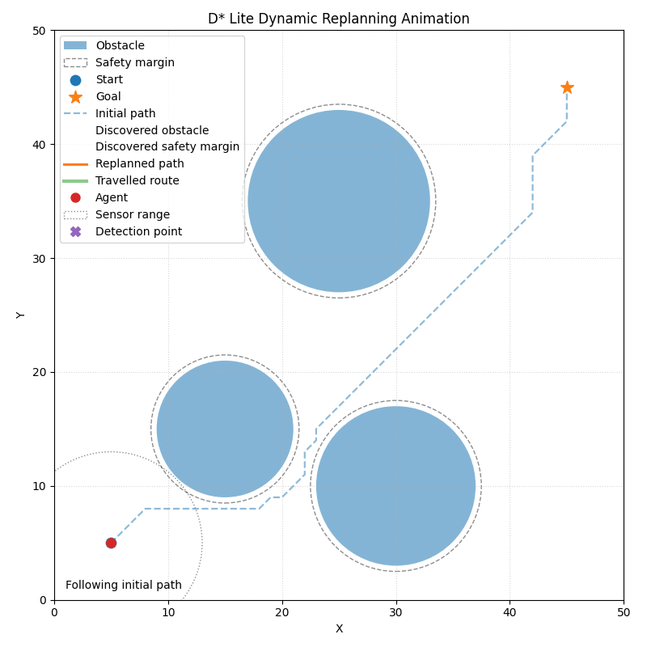
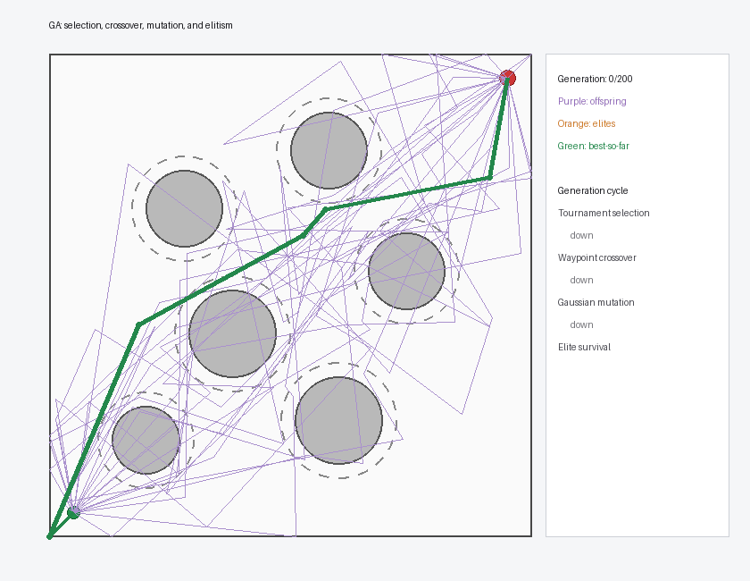
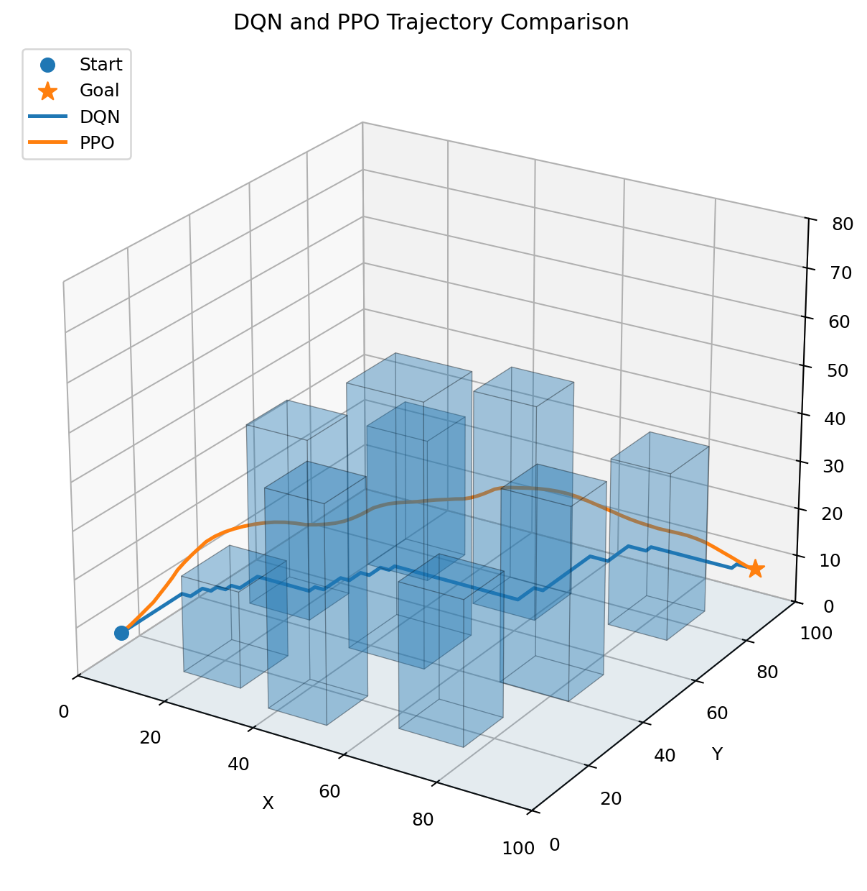
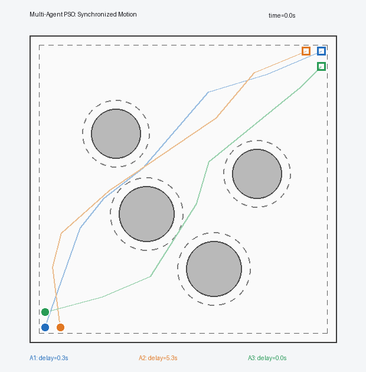

<div align="center">

# Path Planning Practice

### Classical Search · Metaheuristic Optimization · Reinforcement Learning · Multi-Agent Planning

2차원 단일 에이전트 탐색부터 3차원 강화학습 제어와  
다중 에이전트 시공간 공동 최적화까지 단계적으로 구현한 경로 계획 프로젝트 모음.


</div>

<p align="center">
  <a href="./03_Reinforcement_Learning">
    
  </a>
</p>

> 이 저장소는 상태·행동 공간·목적함수와 탐색 메커니즘이 경로 특성에 미치는 차이를 구현과 시각화로 분석하였다.

---

## Project Showcase

<table>
  <tr>
    <td width="50%" valign="top">
      <h3 align="center"><a href="./01_Classical">01 · Classical Planning</a></h3>
      <a href="./01_Classical">
        
      </a>
      <p>
        A*, APF, RRT와 D* Lite를 공통 2차원 환경에서 비교하고, 숨겨진 장애물 발견 후 경로 재계획을 시각화한다.
      </p>
    </td>
    <td width="50%" valign="top">
      <h3 align="center"><a href="./02_Metaheuristics">02 · Metaheuristic Planning</a></h3>
      <a href="./02_Metaheuristics">
        
      </a>
      <p>
        ACO, GA, GWO와 PSO가 동일한 목적함수에서 후보 경로를 생성하고 개선하는 과정을 비교한다.
      </p>
    </td>
  </tr>
  <tr>
    <td width="50%" valign="top">
      <h3 align="center"><a href="./03_Reinforcement_Learning">03 · 3D Reinforcement Learning</a></h3>
      <a href="./03_Reinforcement_Learning">
        
      </a>
      <p>
        DQN의 6방향 이산 이동과 PPO의 연속 가속도 제어가 만드는 3차원 궤적을 정량 비교한다.
      </p>
    </td>
    <td width="50%" valign="top">
      <h3 align="center"><a href="./04_Multi_Agent_Path_Planning">04 · Multi-Agent Planning</a></h3>
      <a href="./04_Multi_Agent_Path_Planning">
        
      </a>
      <p>
        세 에이전트의 공간 경로와 출발 시각을 함께 최적화하고, 연속 시간에서 충돌과 최소 분리 거리를 검증한다.
      </p>
    </td>
  </tr>
</table>

---

## Projects at a Glance

| 폴더 | 주제 | 구현 알고리즘 및 내용 |
|---|---|---|
| [`01_Classical`](01_Classical/) | Classical Path Planning | A*, APF, RRT, D* Lite를 이용한 정적 경로 탐색과 동적 재계획 |
| [`02_Metaheuristics`](02_Metaheuristics/) | Metaheuristic Path Planning | ACO, GA, GWO, PSO를 이용한 단일 에이전트 경로 최적화 |
| [`03_Reinforcement_Learning`](03_Reinforcement_Learning/) | Reinforcement Learning Path Planning | DQN과 PPO를 이용한 3차원 도시 환경의 이산·연속 제어 비교 |
| [`04_Multi_Agent_Path_Planning`](04_Multi_Agent_Path_Planning/) | Multi-Agent Path Planning | ACO, GA, GWO, PSO를 이용한 세 에이전트의 경로와 출발 시각 공동 최적화 |
---


## Repository Structure

```text
Path_Planning_Practice/
├─ 01_Classical/
├─ 02_Metaheuristics/
├─ 03_Reinforcement_Learning/
├─ 04_Multi_Agent_Path_Planning/
└─ README.md
```

세부 문제 정의, 알고리즘 수식, 실험 설정, 실행 방법과 한계는 각 프로젝트 README에서 확인할 수 있습니다.
